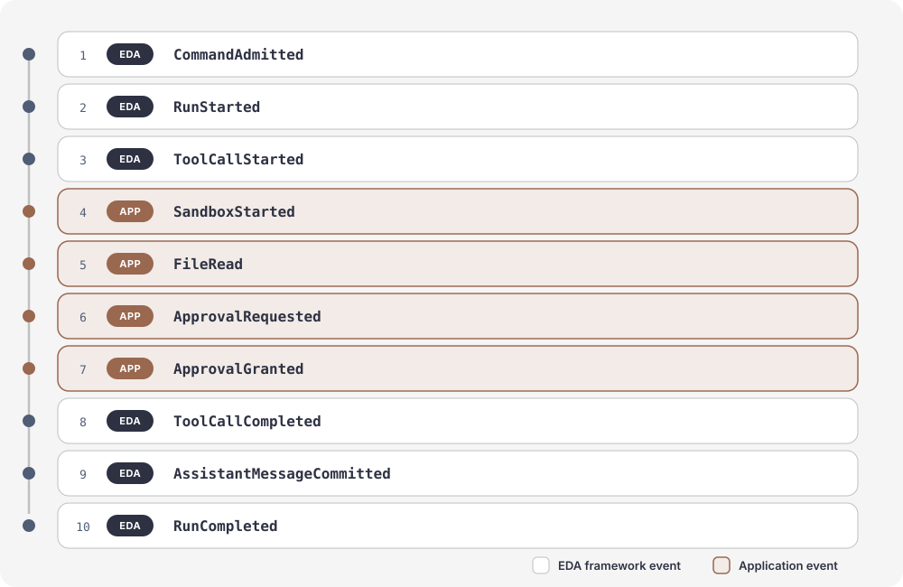
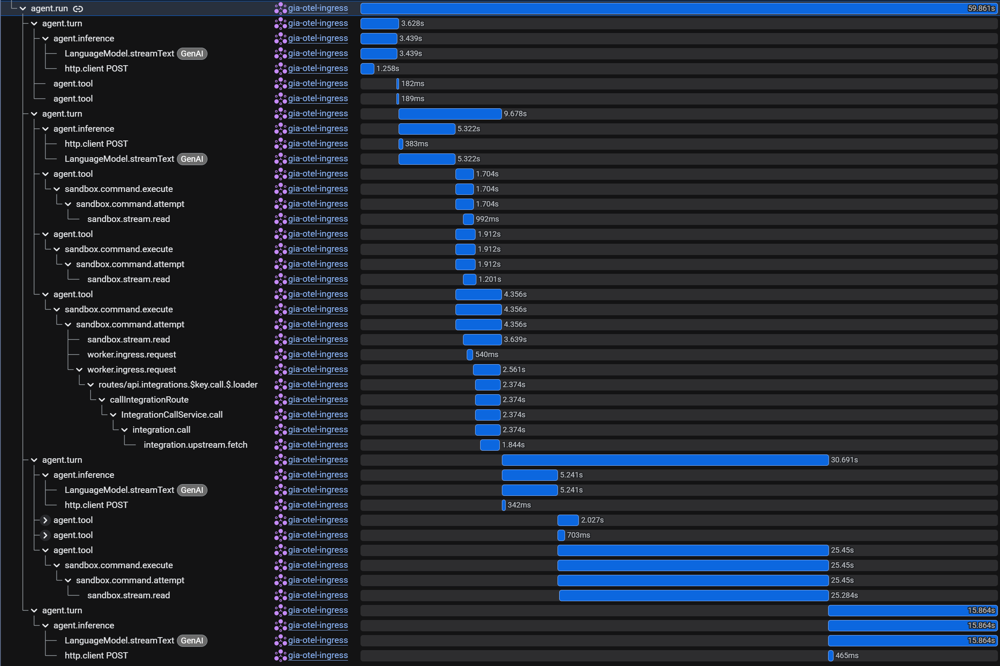

# effect-durable-agent


[](https://www.npmjs.com/package/effect-durable-agent)
[](https://github.com/advait/effect-durable-agent/actions/workflows/ci.yml)

## Why?

Once an agent runs tools, launches sandboxes, requests approval, or interacts with external systems,
you are no longer building a chat loop. You are building a real-time application with many
interdependent lifecycles.

Tool execution constantly changes what that application needs to represent: `Sandbox started`,
`File read`, `Approval requested`. EDA provides a clean framework for **expressing each change as an
event that transitions the application's state machine**. Product state and agent state coexist in
the same event sequence.

## How EDA works

EDA models the agent and the surrounding product as one application state machine. For example, a
coding-agent session might record:



Framework events and product events are not separate channels. They form the same history and
transition the same application state.

If you know Redux, the model is familiar:

- **Events** describe what happened.
- **Reducers** are pure functions that describe how each event changes state.
- **The durable event history** is the source of truth from which current state is derived.

EDA supplies the framework events and reducers for commands, runs, turns, messages, inference, and
tool calls. Applications add their own typed events and reducers for sandboxes, approvals, billing,
external conversations, delivery state, or anything else the product needs to represent.

Those events flow through the rest of the system as follows:


### 1. Session runtime: one state machine for the entire application

User commands and application events enter one centralized session runtime. It manages the entire
application state machine: agent lifecycles such as runs, inference, and tool calls coexist with
product lifecycles such as sandboxes, approvals, and external delivery.

Every transition therefore has one owner and one place to be recorded, rather than leaving session
state scattered across callbacks, workers, and unrelated stores.

### 2. Ordered event log: the definitive history of the state machine

When the state machine transitions, EDA records an event durably and assigns it the next sequence
number for that session. Read in order, those events definitively describe how the application
evolved.

The event log—not an in-memory object or cached snapshot—is the source of truth. Current state,
client updates, recovery, tests, and external delivery are all derived from that ordered history.

### 3. Live event stream: reconnect without losing the session

Live clients subscribe to the event stream over a reconnect-safe WebSocket protocol. Each client
tracks the last durable sequence it has applied.

When a slow or disconnected client returns, it provides that sequence, receives every committed
event after it, and then continues live.

### 4. Pure reducers: events become state

Framework and application reducers fold the ordered event history to produce current state.
Framework events update agent lifecycles; application events update product lifecycles; both
contribute to the same state model.

Reducers are pure: given the same starting state and event, they produce the same next state. That
makes every state transition explicit, replayable, and testable.

### 5. State: a cached view of durable history

The reducers produce a complete snapshot of framework and application state through a known
sequence number. EDA caches that snapshot in Durable Object SQLite so reads and restarts do not
need to replay the entire history from the beginning.

The cache is an optimization, not a second source of truth. If it is missing or incompatible, EDA
can rebuild it from the event log; the application is ultimately defined by its ordered events.

### 6. Pure projections: UI state is not model context

State is not the final representation consumed by either people or models. The UI is a pure
projection of state, and the LLM context is a separate pure projection of that same state.

The UI can preserve tool progress, approvals, sandbox status, and rich product history while the
LLM context selects and compacts only what the model should see. Applications can model each
consumer honestly instead of collapsing both into one constrained representation. See the
[UI projection guide](./docs/ui-projection.md) for the projection contract.

### 7. Durable sinks: callbacks that survive failure

Framework and application events often need to trigger side effects in external systems: post to
Slack, write to a database, or notify another service. Handling them in ordinary callbacks makes
delivery depend on the health of the current process.

EDA handles this with durable sinks, which behave like durable callbacks over committed session
history. EDA delivers events to each sink in sequence order, persists its progress, retries
failures, and resumes after application restarts. Sinks run independently of the application loop,
so external delivery does not block application progress. Durable retries let external systems
converge on committed session history with eventual-consistency guarantees.

Delivery is at-least-once, so external operations must be idempotent. Each durable event carries a
stable event ID that, together with its session ID, provides the operation's idempotency key.

## What this unlocks

### Live state on every client

Every tab, embedded surface, and admin view follows the same durable session. If one client loses
its connection or falls behind, it returns to the current state instead of resetting the session or
guessing which updates it missed.

Server-side rendering does not require a second state model. The server can render a durable
snapshot, and the browser can continue from that exact point as new events arrive.

### Durable side effects

If `AssistantMessageCommitted` should post a result to Slack and Slack is unavailable, the agent
keeps moving. When Slack recovers, it receives the committed events and converges with the session
history. External availability stays off the application's critical path without sacrificing
reliable delivery.

See the [Slack bridge example](./examples/002-slack-bridge) for idempotent ingress, a custom reducer,
and durable outbound delivery.

**Durable state. Durable side effects.**

### Agents survive deploys and failures

Deploys and failures restart the application—not the session.

EDA rebuilds framework and product state from durable history, repairs incomplete lifecycle
boundaries, and transparently continues eligible in-progress work in a replacement run. Completed
tool calls are not blindly repeated, queued commands remain durable, and reconnecting clients see
the recovery transitions before new live activity.

### Production sessions become UI fixtures

A production event sequence can become a test fixture. Replay it one event at a time, stop at any
sequence, and assert exactly what the UI should show: the running tool card, the active sandbox, the
pending approval, the completed delivery, or the recovered run.

A difficult production session becomes a reproducible UI test instead of a story in a bug report.
The package includes pure reducer tests, generated state-machine properties, canned-model journeys,
crash-prefix simulations, and an [offline trace harness](./testing/offline-trace) that writes durable
and live event artifacts.

### Tracing for every agent run

See what happened, in what order, and where the time went.

EDA uses Effect spans across meaningful runtime boundaries, including command admission, runs,
turns, model inference, tools, event streaming, durable sinks, and recovery. Trace context survives
the durable boundaries that separate ingress, execution, and side effects, and Effect telemetry can
be exported through OpenTelemetry to Google Cloud Trace or another existing backend.



## Built for Cloudflare Durable Objects

EDA's first host maps one session to one
[Cloudflare Durable Object](https://developers.cloudflare.com/durable-objects/). The object is the
durable coordinator for that session's state, execution, SQLite event log, live WebSockets, alarms,
and sink cursors.

This is an unusually natural fit:

- Deterministic routing sends every request for a session to the same logical object
- Per-object SQLite stores the ordered history beside the runtime that owns it
- WebSockets terminate at the same boundary that owns the state
- Alarms wake evicted sessions for recovery, keep-alive, and sink draining

Durable Objects are the first host, not the whole architecture. EDA's runtime depends on small
storage, scheduling, identity, and live-delivery boundaries that another platform can implement
with equivalent semantics.

## Get started

Install the public alpha from npm. Using the `alpha` tag keeps prerelease consumers on the current
alpha channel:

```bash
pnpm add effect-durable-agent@alpha
```

The smallest host is a concrete Durable Object subclass:

```ts
import { EDASessionDurableObject } from "effect-durable-agent/host/durable-object"

export class MyAgentSession extends EDASessionDurableObject<MyEnv> {
  constructor(ctx: DurableObjectState, env: MyEnv) {
    super(ctx, env, makeAgentOptions(env))
  }
}
```

The options provide the model, tools, application reducers, durable sinks, and runtime policy. The
host then submits commands to the session and follows its snapshot or event stream.

Start with the executable examples:

| Example | What it demonstrates |
| --- | --- |
| [`001-no-tools`](./examples/001-no-tools) | Minimal Durable Object session and durable command admission. |
| [`002-slack-bridge`](./examples/002-slack-bridge) | Idempotent ingress, application events and reducers, and a retrying durable sink. |
| [`003-sandbox-lifecycle`](./examples/003-sandbox-lifecycle) | Tool and product events reduced into one UI model, including snapshot-to-stream handoff. |

## Why EDA instead of another agent SDK or framework?

Consider a coding agent that:

- Launches a sandbox and reads files
- Streams progress to two browser tabs
- Pauses for human approval
- Posts its result to Slack after approval
- Keeps working through a deployment

That product needs more than a model loop. It needs durable application state, live client
synchronization, restart recovery, and reliable external delivery. Agent frameworks make different
parts of that system their primary durable abstraction:

| Center of gravity | Projects | Durable model |
| --- | --- | --- |
| Agent execution | [OpenAI Agents SDK](https://openai.github.io/openai-agents-js/), [Pi](https://pi.dev/docs/latest/sdk) | Live agent runs plus separately persisted conversations, run snapshots, or session entries. |
| Durable agent harness | [Cloudflare Project Think](https://developers.cloudflare.com/agents/harnesses/think/), [Flue](https://flueframework.com/), [Vercel Eve](https://vercel.com/eve) | Durable runtime history plus framework-specific state, action, hook, and extension surfaces. |
| Workflow graph | [LangChain / LangGraph](https://docs.langchain.com/oss/javascript/langgraph/overview) | Reducer-managed graph state persisted as checkpoints between super-steps. |
| Application state | **Effect Durable Agent** | Application-authored product and agent events in one ordered history. |

All of these frameworks can build agents. The difference is what each architecture makes primary.
Among them, EDA is the one whose central abstraction is an application-authored history shared by
agent execution, product state, clients, tests, and side effects.

In the scenario above, `SandboxStarted`, `FileRead`, `ApprovalRequested`, and
`SlackReplyDelivered` live beside model and tool events. The same history drives server state,
client catch-up, restart recovery, production-derived UI fixtures, and durable sink delivery.

<details>
<summary>Primary sources used for this comparison</summary>

- Think: [state snapshots](https://developers.cloudflare.com/agents/runtime/lifecycle/state/),
  [actions](https://developers.cloudflare.com/agents/harnesses/think/actions/), and
  [durable fibers](https://developers.cloudflare.com/agents/runtime/execution/durable-execution/)
- OpenAI Agents SDK: [sessions](https://openai.github.io/openai-agents-js/guides/sessions/),
  [serialized run state](https://openai.github.io/openai-agents-js/guides/human-in-the-loop/), and
  [streaming](https://openai.github.io/openai-agents-js/guides/streaming/)
- Pi:
  [RPC events](https://pi.dev/docs/latest/rpc#events) and
  [session format](https://pi.dev/docs/latest/session-format)
- Flue: [events](https://flueframework.com/docs/api/events-reference/) and
  [application data boundaries](https://flueframework.com/docs/guide/database/)
- Eve: [application state](https://eve.dev/docs/guides/state),
  [client reducers](https://eve.dev/docs/guides/frontend/overview), and
  [event hooks](https://eve.dev/docs/guides/hooks)
- LangGraph: [graph state](https://docs.langchain.com/oss/javascript/langgraph/graph-api) and
  [persistence](https://docs.langchain.com/oss/javascript/langgraph/persistence)

</details>

## Capabilities

- Effect-native agent runtime with command, run, turn, inference, message, and tool lifecycles
- Cloudflare Durable Object host with one session per object and SQLite event storage
- Typed custom durable application events and pure application reducers
- Reducer checkpoints and serialized snapshots
- Reconnect-safe event streaming with sequence resume and WebSocket ACK flow control
- Durable sinks with persisted cursors, at-least-once delivery, and retry
- Deterministic startup recovery with transparent continuation of eligible work
- Pluggable model-context compaction policies and executors
- Interoperability with [Effect AI](https://www.effect.website/docs/v3/ai/introduction) models,
  providers, prompts, and toolkits
- Tool calls run as scoped Effect programs for interruption-safe cancellation and resource cleanup
- Trace propagation and Effect span instrumentation across runtime boundaries
- Queue, steer, interrupt, stop, and idempotent command admission

## Why Effect?

Agent sessions combine long-running model streams, concurrent tools, interruption, cleanup, retries,
external services, and observability. EDA uses [Effect](https://effect.website/) so those concerns
share one structured execution model rather than a collection of detached promises and callbacks.

Effect is the implementation foundation, not the product pitch. The reason to use EDA is the
durable application model; Effect is what lets the runtime execute that model with scoped resources,
typed boundaries, structured concurrency, and first-class tracing.

## Documentation

- [Current implementation](./docs/spec.md)
- [Testing strategy](./docs/testing.md)
- [WebSocket live-event protocol](./docs/websocket-protocol.md)
- [Message steering](./docs/message-steering.md)
- [UI projection proposal](./docs/ui-projection.md)
- [Subagents proposal](./docs/subagents.md)
- [Maintainer release guide](./docs/releasing.md)

## Contributing and license

See [CONTRIBUTING.md](./CONTRIBUTING.md) to run the project and validate the npm package. Effect
Durable Agent is available under the [MIT License](./LICENSE). Please report vulnerabilities
through the process in [SECURITY.md](./SECURITY.md).
