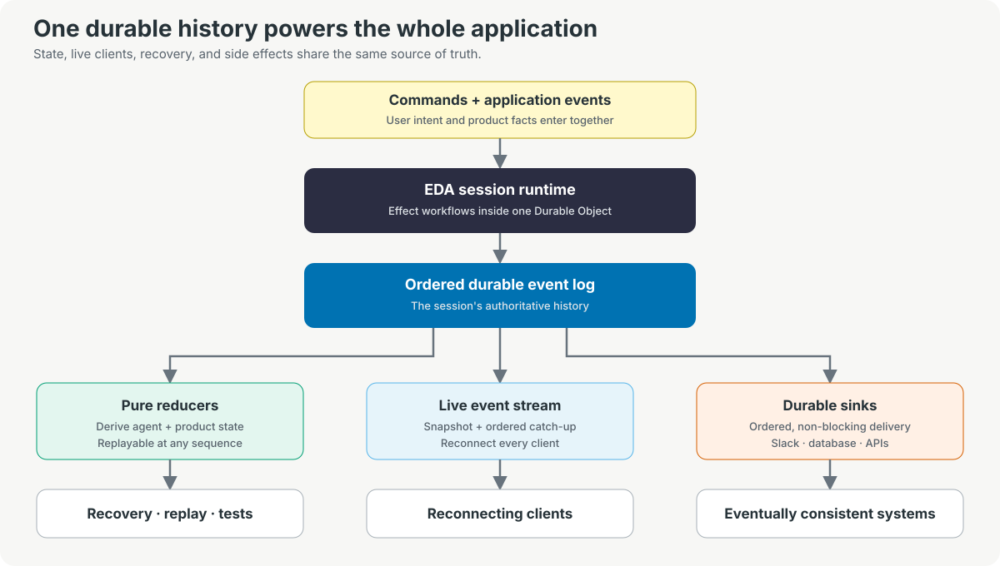

# effect-durable-agent

> EDA is a Redux-inspired durable state-management layer for agentic applications, hosted on
[Cloudflare Durable Objects](https://developers.cloudflare.com/durable-objects/).

## Why?

Once an agent runs tools, launches sandboxes, requests approval, or interacts with external systems,
you are no longer building a chat loop. You are building a real-time application with many
interdependent lifecycles.

Tool execution constantly changes what that application needs to represent: `Sandbox started`,
`File read`, `Approval requested`. EDA provides a clean framework for **expressing each change as an
event that transitions the application's state machine**. Product state and agent state coexist in
the same event sequence.

Your application describes how events like `SandboxStarted` and `ApprovalRequested` change its
state. EDA records them in one durable history, giving agent state and product state a shared source
of truth. It streams those same events to clients. Each client uses them to update its local state,
so every view converges on the durable session state—even across tabs and reconnects.

## One state machine for the whole application

For example, a coding-agent session might record:


Framework events and product events are not separate channels. They form the same history and
transition the same application state.

If you know Redux, the model is familiar:

- **Events** describe what happened.
- **Reducers** are pure functions that describe how each event changes state.
- **The durable event history** is the source of truth from which current state is derived.

EDA supplies the framework events and reducers for commands, runs, turns, messages, inference, and
tool calls. Applications add their own typed events and reducers for sandboxes, approvals, billing,
external conversations, delivery state, or anything else the product needs to represent.

## What this unlocks

### Live state on every client

EDA exposes serialized reducer snapshots and streams the ordered session history over a
reconnect-safe WebSocket protocol. In a server-side rendering (SSR) flow, the server renders state
through sequence `N`; the browser hydrates from that snapshot, follows events after `N`, and applies
its application projection as they arrive.

```text
server snapshot through N
          +
streamed events after N
          =
current client state
```

Every tab, embedded surface, or admin view follows the same durable session. Slow and disconnected
clients catch up from their last acknowledged sequence instead of guessing which updates they
missed.

### Durable side effects

EDA makes side effects durable.

If `AssistantMessageCommitted` should post a result to Slack and Slack is temporarily unavailable,
the Slack sink applies its own bounded retry policy. Durable sinks run independently of the main
agent loop, preserve event order, and track their own persisted cursor. Their typed error channel is
`never`: each sink must decide which failures to retry and how to log or otherwise handle a terminal
failure before returning.

Delivery is at-least-once, so external operations still need stable idempotency keys. The important
guarantee is that a transient process or network failure does not silently erase the work.

See the [Slack bridge example](./examples/002-slack-bridge) for idempotent ingress, a custom reducer,
and durable outbound delivery.

**Durable state. Durable side effects.**

### Agents survive deploys and failures

Deploys and failures restart the application—not the session.

EDA rebuilds framework and product state from durable history, repairs incomplete lifecycle
boundaries, and transparently continues eligible in-progress work in a replacement run. Completed
tool calls are not blindly repeated, queued commands remain durable, and reconnecting clients see
the recovery transitions before new live activity.

### Production sessions become UI fixtures

Because application state is a pure projection of durable events, a production event sequence can
become a test fixture.

Replay it one event at a time through the same reducers, stop at any sequence, and assert exactly
what the UI should show: the running tool card, the active sandbox, the pending approval, the
completed delivery, or the recovered run. A difficult production session becomes a reproducible UI
test instead of a story in a bug report.

The package includes pure reducer tests, generated state-machine properties, canned-model journeys,
crash-prefix simulations, and an [offline trace harness](./testing/offline-trace) that writes
durable and live event artifacts.

### Tracing for every agent run

See what happened, in what order, and where the time went.

EDA uses Effect spans across meaningful runtime boundaries, including command admission, runs,
turns, model inference, tools, event streaming, durable sinks, and recovery. Trace context survives
the durable boundaries that separate ingress, execution, and side effects, and Effect telemetry can
be exported through OpenTelemetry to Google Cloud Trace or another existing backend.


### Built for Cloudflare Durable Objects

EDA's first host maps one session to one
[Cloudflare Durable Object](https://developers.cloudflare.com/durable-objects/). The object is the
durable coordinator for that session's state, execution, SQLite event log, live WebSockets, alarms,
and sink cursors.

This is an unusually natural fit:

- Deterministic routing sends every request for a session to the same logical object
- Per-object SQLite stores the ordered history beside the runtime that owns it
- WebSockets terminate at the same boundary that owns the state
- Alarms wake evicted sessions for recovery, keep-alive, and sink draining

Durable Objects are the first host, not the whole architecture. EDA's runtime depends on small
storage, scheduling, identity, and live-delivery boundaries that another platform can implement
with equivalent semantics.

## Core concepts



Effect owns the execution around this state machine: structured concurrency, streams, interruption,
scoped resources, typed failures, retries, services, and tracing. The event history owns durable
truth.

### Durable and ephemeral events

EDA's ordered event stream carries two types of events:

- **Durable events** are persisted facts with a monotonically increasing per-session `seq`. They
  drive reducers, recovery, reconnect, tests, and durable sinks
- **Ephemeral events** carry live-only details such as text deltas, reasoning deltas, and speculative
  tool parameters. They are positioned against the current durable head but are not durable truth

A durable event is published live only after storage commits it.

### Pure reducers

Reducers turn durable events into current state. EDA's framework reducer derives commands, runs,
turns, messages, inference, and tool state. Applications register their own reducers for product
state such as sandboxes, approvals, billing, or external delivery.

Framework and application reducers fold the same ordered history. Their checkpoints accelerate
startup and snapshots; the event log remains the source of truth.

### Live event stream

Clients begin with a reducer snapshot through sequence `N`, replay durable events after `N`, and
then follow new durable and ephemeral events live. Sequence-based catch-up lets every connected
view converge without coupling a slow client to agent execution.

### Durable sinks

Durable sinks process committed events outside the main agent loop. Each sink preserves event
ordering, tracks an independent durable cursor, and advances only after successful processing.
Failures retry with backoff, so external systems converge eventually without blocking the agent.

### Session runtime

One session has at most one active run and turn. The runtime:

1. Durably admits a command
2. Starts and traces the run, turn, and inference
3. Commits message and tool lifecycle facts
4. Folds framework and application reducers
5. Publishes positioned events to live clients
6. Drains durable sinks
7. Recovers from the durable history after a restart

## Get started

Install EDA from npm:

```bash
pnpm add @advait/effect-durable-agent
```

The smallest host is a concrete Durable Object subclass:

```ts
import { EDASessionDurableObject } from "@advait/effect-durable-agent/host/durable-object"

export class MyAgentSession extends EDASessionDurableObject<MyEnv> {
  constructor(ctx: DurableObjectState, env: MyEnv) {
    super(ctx, env, makeAgentOptions(env))
  }
}
```

The options provide the model, tools, application reducers, durable sinks, and runtime policy. The
host then submits commands to the session and follows its snapshot or event stream.

Start with the executable examples:

| Example | What it demonstrates |
| --- | --- |
| [`001-no-tools`](./examples/001-no-tools) | Minimal Durable Object session and durable command admission. |
| [`002-slack-bridge`](./examples/002-slack-bridge) | Idempotent ingress, application events and reducers, and a retrying durable sink. |
| [`003-sandbox-lifecycle`](./examples/003-sandbox-lifecycle) | Tool and product events reduced into one UI model, including snapshot-to-stream handoff. |

## Why Effect?

Agent sessions combine long-running model streams, concurrent tools, interruption, cleanup, retries,
external services, and observability. EDA uses [Effect](https://effect.website/) so those concerns
share one structured execution model rather than a collection of detached promises and callbacks.

Effect is the implementation foundation, not the product pitch. The reason to use EDA is the
durable application model; Effect is what lets the runtime execute that model with scoped resources,
typed boundaries, structured concurrency, and first-class tracing.

## Why EDA instead of another agent SDK or framework?

Consider a coding agent that:

- Launches a sandbox and reads files
- Streams progress to two browser tabs
- Pauses for human approval
- Posts its result to Slack after approval
- Keeps working through a deployment

That product needs more than a model loop. It needs durable application state, live client
synchronization, restart recovery, and reliable external delivery. Agent frameworks make different
parts of that system their primary durable abstraction:

| Center of gravity | Projects | Durable model |
| --- | --- | --- |
| Agent execution | [OpenAI Agents SDK](https://openai.github.io/openai-agents-js/), [Pi](https://pi.dev/docs/latest/sdk) | Live agent runs plus separately persisted conversations, run snapshots, or session entries. |
| Durable agent harness | [Cloudflare Project Think](https://developers.cloudflare.com/agents/harnesses/think/), [Flue](https://flueframework.com/), [Vercel Eve](https://vercel.com/eve) | Durable runtime history plus framework-specific state, action, hook, and extension surfaces. |
| Workflow graph | [LangChain / LangGraph](https://docs.langchain.com/oss/javascript/langgraph/overview) | Reducer-managed graph state persisted as checkpoints between super-steps. |
| Application state | **Effect Durable Agent** | Application-authored product and agent events in one ordered history. |

All of these frameworks can build agents. The difference is what each architecture makes primary.
Among them, EDA is the one whose central abstraction is an application-authored history shared by
agent execution, product state, clients, tests, and side effects.

In the scenario above, `SandboxStarted`, `FileRead`, `ApprovalRequested`, and
`SlackReplyDelivered` live beside model and tool events. The same history drives server state,
client catch-up, restart recovery, production-derived UI fixtures, and durable sink delivery.

<details>
<summary>Primary sources used for this comparison</summary>

- Think: [state snapshots](https://developers.cloudflare.com/agents/runtime/lifecycle/state/),
  [actions](https://developers.cloudflare.com/agents/harnesses/think/actions/), and
  [durable fibers](https://developers.cloudflare.com/agents/runtime/execution/durable-execution/)
- OpenAI Agents SDK: [sessions](https://openai.github.io/openai-agents-js/guides/sessions/),
  [serialized run state](https://openai.github.io/openai-agents-js/guides/human-in-the-loop/), and
  [streaming](https://openai.github.io/openai-agents-js/guides/streaming/)
- Pi:
  [RPC events](https://pi.dev/docs/latest/rpc#events) and
  [session format](https://pi.dev/docs/latest/session-format)
- Flue: [events](https://flueframework.com/docs/api/events-reference/) and
  [application data boundaries](https://flueframework.com/docs/guide/database/)
- Eve: [application state](https://eve.dev/docs/guides/state),
  [client reducers](https://eve.dev/docs/guides/frontend/overview), and
  [event hooks](https://eve.dev/docs/guides/hooks)
- LangGraph: [graph state](https://docs.langchain.com/oss/javascript/langgraph/graph-api) and
  [persistence](https://docs.langchain.com/oss/javascript/langgraph/persistence)

</details>

## Capabilities

- Effect-native agent runtime with command, run, turn, inference, message, and tool lifecycles
- Cloudflare Durable Object host with one session per object and SQLite event storage
- Typed custom durable application events and pure application reducers
- Reducer checkpoints and serialized snapshots
- Reconnect-safe event streaming with sequence resume and WebSocket ACK flow control
- Durable sinks with persisted cursors and app-owned retry and terminal-failure policies
- Deterministic startup recovery with transparent continuation of eligible work
- Pluggable model-context compaction policies and executors
- Interoperability with [Effect AI](https://www.effect.website/docs/v3/ai/introduction) models,
  providers, prompts, and toolkits
- Tool calls run as scoped Effect programs for interruption-safe cancellation and resource cleanup
- Trace propagation and Effect span instrumentation across runtime boundaries
- Queue, steer, interrupt, stop, and idempotent command admission

## Documentation

- [Current implementation](./docs/spec.md)
- [Testing strategy](./docs/testing.md)
- [WebSocket live-event protocol](./docs/websocket-protocol.md)
- [Message steering](./docs/message-steering.md)
- [UI projection proposal](./docs/ui-projection.md)
- [Subagents proposal](./docs/subagents.md)

## Contributing and license

See [CONTRIBUTING.md](./CONTRIBUTING.md) to run the project and validate the npm package. Effect
Durable Agent is available under the [MIT License](./LICENSE). Please report vulnerabilities
through the process in [SECURITY.md](./SECURITY.md).
